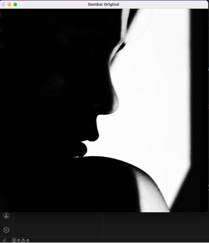
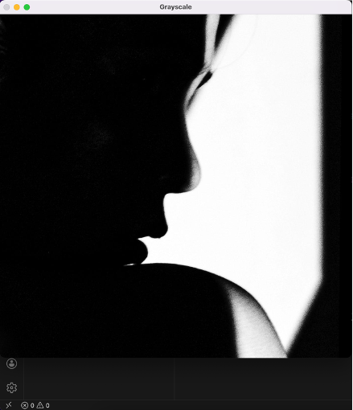
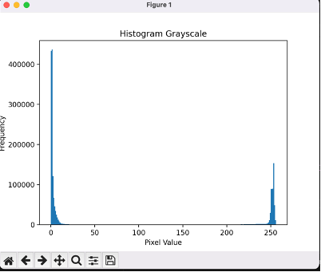
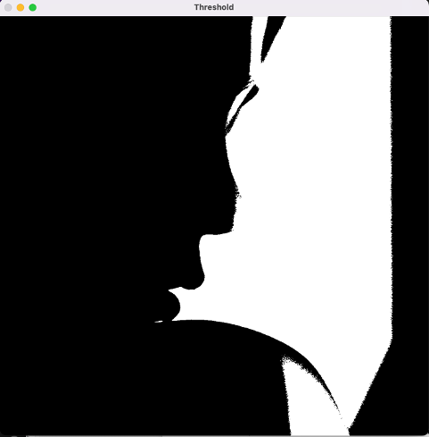
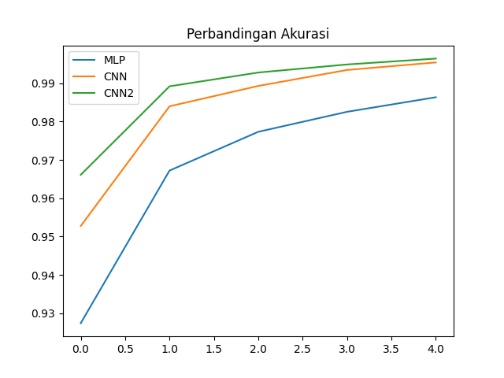
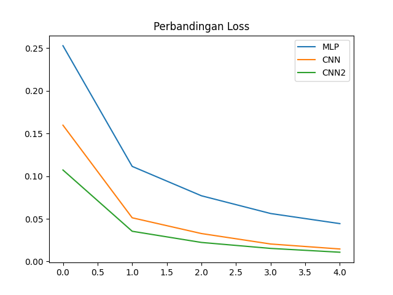
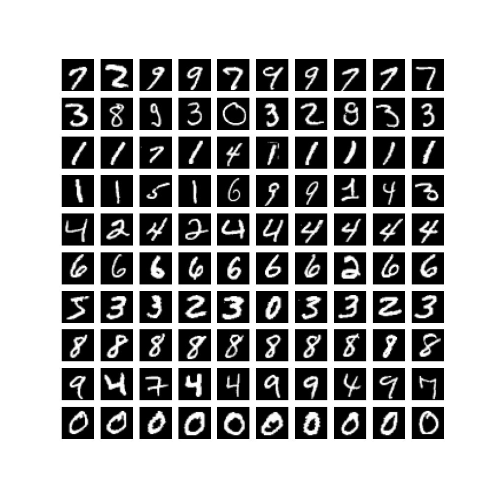

# 🧠 Advanced Computer Vision Project

This repository contains a collection of computer vision projects developed as part of the Advanced Computer Vision course.

The goal of this project is to explore various approaches in image processing, supervised learning, unsupervised learning, and modern deep learning architectures.

---

## 📌 Project Overview

This project consists of several experiments:

1. Image Processing using OpenCV  
2. MNIST Classification (MLP vs CNN)  
3. K-Means Clustering  
4. CNN Experiment (Fashion-MNIST)  
5. Vision Transformer Analysis  

---

## 🖼️ 1. Image Processing (OpenCV)

Basic image processing techniques were implemented using OpenCV, including:

- Image reading
- Grayscale conversion
- Histogram analysis
- Thresholding

### 📷 Results

| Original | Grayscale |
|----------|-----------|
|  |  |

| Histogram | Threshold |
|----------|-----------|
|  |  |

---

## 🔢 2. MNIST Classification (MLP vs CNN)

Three models were implemented:

- MLP (Multi-Layer Perceptron)
- CNN
- Deep CNN

### 📊 Results

| Model | Accuracy |
|------|---------|
| MLP | 0.9783 |
| CNN | 0.9848 |
| CNN Deep | 0.9890 |

### 📷 Visualization

  

---

## 🔍 3. K-Means Clustering

Unsupervised learning was applied using K-Means to group digit images.

### 📷 Clustering Result

---

## 🧪 4. CNN Experiment (Fashion-MNIST)

Experiment conducted by varying model parameters:

| Model | Configuration | Accuracy |
|------|--------------|---------|
| Model A | 32 filters, 1 layer | 0.9071 |
| Model B | 64 filters, 1 layer | 0.8986 |
| Model C | 64 filters, 2 layers | 0.9133 |

### 📷 Result

---

## 🤖 5. Vision Transformer (ViT)

Analysis of a Vision Transformer-based model for image classification.

### 📌 Key Points:

- Uses self-attention instead of convolution
- Captures global relationships in images
- Achieved ~78% accuracy (based on analyzed paper)

---

## 📊 Comparison Summary

| Method | Type | Performance |
|--------|------|------------|
| MLP | Supervised | Good |
| CNN | Supervised | Very Good |
| CNN Deep | Supervised | Best |
| K-Means | Unsupervised | Limited |
| Vision Transformer | Modern | Promising |

---

## 💡 Insights

- CNN outperforms MLP due to spatial feature extraction
- Deeper models improve accuracy
- Data quality greatly affects performance
- Unsupervised methods are useful but limited
- Vision Transformer is a powerful modern approach

---

## 🧠 Personal Reflection

During this project, several challenges were encountered, especially in setting up the environment and dealing with TensorFlow installation issues.

Through debugging and experimentation, a deeper understanding of the machine learning workflow was achieved, including data preprocessing, model training, and evaluation.

This project also provided valuable insight into different approaches in computer vision, from traditional image processing to modern deep learning techniques.

---

## 📁 Project Structure
